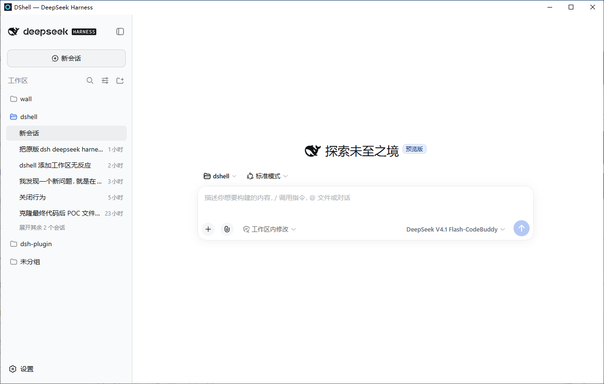
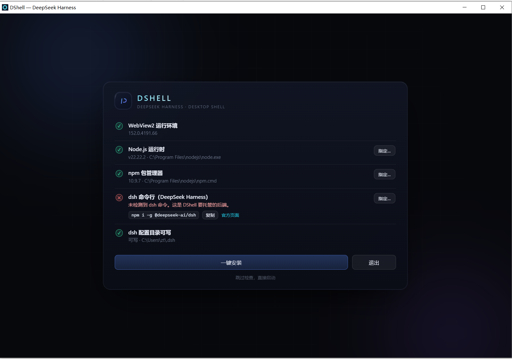
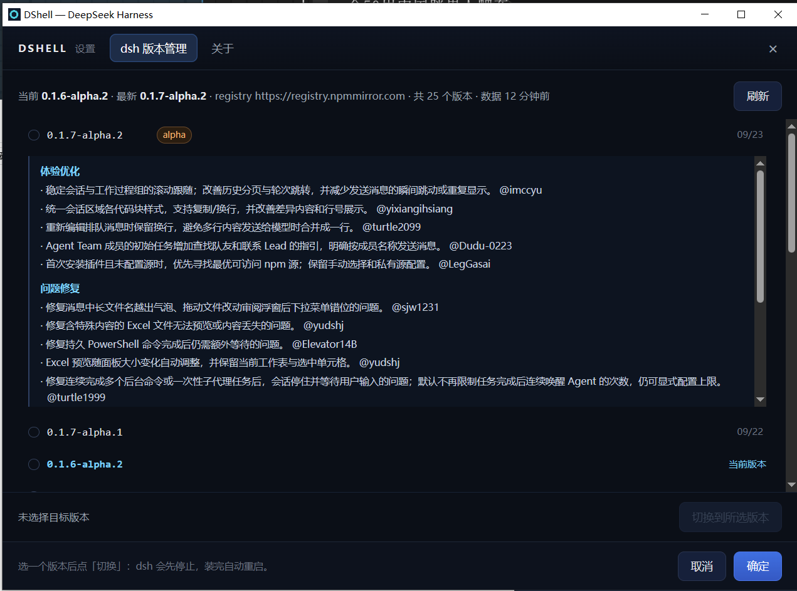

# DShell

把 [DeepSeek Harness](https://github.com/deepseek-ai/deepseek-harness) 的 Web GUI 包成一个桌面程序：双击即用，不用挂终端、不用敲 `dsh web`、不用自己去浏览器输地址。

薄壳设计——复用你机器上已装的 Node.js 和 `@deepseek-ai/dsh`，exe 只有几 MB。

> 可用，但尚未完成。详见 [Roadmap](docs/roadmap.md)。



## 为什么需要它

直接开 `http://127.0.0.1:3080/` 会 **401**。DSH 要求先带 `?token=<每进程随机>` 访问一次换取 cookie，而 WebView 有自己的 cookie 罐，冷启动开裸地址必然被拒。

那个 token 藏在 `dsh web` 的 stdout 里。DShell 做的事就是：

1. 后台静默启动 `dsh web --port 0 --no-open`
2. 从 stdout 抓出带 token 的 URL
3. 用它打开窗口 → 换来 cookie → 真 UI 加载
4. 关窗时收掉整棵进程树

```
DShell.exe ──spawn──▶ dsh web --port 0
     │                      │
     │◀────stdout: token URL─┘
     │
     └──navigate──▶ 303 → Set-Cookie → 200 ✓
```

## 构建

需要 Rust 工具链、MSVC linker、WebView2 runtime（Win10 1803+ 通常自带）。

### 开发构建（日常用这个）

```powershell
.\scripts\dev-build.ps1
```

产出**自包含**的时间戳目录，双击里面那个 exe 即可：

```
src-tauri\target\20260914-091044\
    dshell.exe
    plugin\dshell-directory-picker\     ← exe 启动时要读它
```

用 `yyyyMMdd-HHmmss` 另开目录是为了不打断你正在调试的实例：DShell 运行时会锁住
`target\release\dshell.exe`，固定路径就必须先关掉旧实例才能编下一版。时间戳目录
让新旧并存，编译永远能成功，也能开两个实例做对比。默认保留最近 5 次（`-Keep N`）。

`plugin\` 必须和 exe 并排：Tauri 在 `bundle.active: false` 时把
`bundle.resources` 导出到 exe **同级**目录，而不是嵌进 exe。脚本总是把它一起
放好，并在缺失时直接失败，不产出残包。

加 `-Dev` 编 debug 版（快得多，只验证能不能编过），产物目录名带 `-dev` 后缀。

### 直接 cargo

```powershell
cd src-tauri
cargo build --release
```

产物在 `src-tauri/target/release/`，但**要自己确认那里的 `plugin\` 目录也在**，
否则选目录的即时刷新会静默失效。

### 发布

推 `v*` tag 触发 [release.yml](.github/workflows/release.yml)，产出
`DShell-<tag>-windows-x86_64.zip`，内含 exe + `plugin\`。日常 push 由
[ci.yml](.github/workflows/ci.yml) 做编译检查，并验证插件确实被一起导出。

> 发布物是**两个东西**（exe + `plugin\` 目录），不是单文件。原因是
> `bundle.active: false` 时 Tauri 不把 resource 嵌进 exe。冒烟测试与 release
> 流程都已强制两者同行，但**别只把 exe 拷走**。

## 让「添加工作区」即时刷新（exe 自动完成）

那个"选完目录要点一下鼠标才刷新"的问题，修法是把选目录的交互交给壳层。这需要
两半配合，而且**两半都在你双击的那个 exe 里了**：

| 一半 | 住在哪 | 谁负责 |
| --- | --- | --- |
| 提供端口 `DSHELL_PICKER_PORT` | DShell 启动 `dsh web` 时注入 | exe（编译进去的） |
| 消费端口（一个 dsh 插件） | dsh 的 profile：`~/.dsh/profiles/web` | exe 启动时**自动安装** |

启动体检的第 ⑥ 项「原生目录选择器（自带插件）」做的就是第二件事：把随 exe
发布的插件复制进 profile 并登记到 `dsh.profile.bundles`。插件零依赖，**不需要
npm / pnpm**，用户双击即用。

这一项失败（比如 profile 目录不可写）**不会拦住启动**，只会在体检里显示黄字——
它只影响"选完目录要不要补点一下"，不该让整个应用起不来。profile 尚未创建时
（dsh 从没跑过）会跳过安装，下次启动自动补上。

诊断或手动兜底：

```powershell
.\scripts\install-picker-plugin.ps1            # 手动装（旧版 exe / 自动装失败时）
.\scripts\install-picker-plugin.ps1 -Uninstall # 恢复原状
```

> 自动安装**只复制、绝不覆盖已有安装**。开发期如果想用 junction 链到源码
> （改完插件不用重装），跑一次上面的脚本即可——自动安装会认出它并保留。

原理：dsh 在 Windows 上会用**独立子进程**弹一个**没有 owner** 的原生对话框，
主窗口因此失焦，WebView2 随即挂起渲染进程（实测 11.7 秒），解冻后界面不提交
更新。插件把选目录转交给壳层，由壳层用**带 owner** 的对话框弹出，主窗口不失焦，
挂起的前提就消失了。详见 [docs/closed/04](docs/closed/04-workspace-add-no-refresh.md)。

## 使用

双击运行。启动页会先做一次环境体检，逐项汇报：

```
① WebView2 运行环境   ② Node.js   ③ npm   ④ dsh   ⑤ dsh 配置目录可写
```

缺什么就显示什么，并且给得出路：

- **指定…**：单独指定某一项的可执行文件路径（会就地验证一次，通过才记住）
- **一键安装**：走官方通道补齐（Node 用 `winget`，dsh 用 `npm i -g @deepseek-ai/dsh`），装完自动复检
- **退出**

全部通过就自动接管：起 `dsh web` → 抓 token URL → 换 cookie → 进入真正的 DSH UI。
装完/指定过的路径记在 `%USERPROFILE%\.dshell\config.json`，日志写在 `%USERPROFILE%\.dshell\dshell-poc.log`。

调试时可以设 `DSHELL_SPLASH_HOLD=1`：跑完体检但停在报告页不接管，方便截图或调动画。

体检与安装的设计与实测记录见 [docs/closed](docs/closed/)。



## 设置与 dsh 版本管理

托盘 →「设置」打开一个**主窗口内的覆盖层**（不是独立窗口，dsh 页面不重载，进行中的对话不中断）。

「dsh 版本管理」把 registry 上所有发布过的版本列出来，最新的在上：

- 右列是该版本的**发布日期**（按本机时区；同年不显示年份）。列表因此本身就是一条时间线。
- **点日期**看这一版改了什么。更新内容取自 GitHub Releases 的中文说明，**按需拉取**并缓存 2 小时 —— 不点就不联网。dsh 的 npm 包里没有任何 changelog 字段，这是唯一的来源。
- 选中一版点「切换」：dsh 先停止 → `npm i -g` → 装完自动重启。

**降级会被拦一道**：dsh 的同级包用 `^` 引用，直接装旧版会配到新版依赖，装出一棵起不来的树
（实测 `0.1.6-alpha.1` 就是这样）。所以降级除了警告与二次确认，还会用**发布时间窗**
（`npm --before`）安装，把依赖解析拉回那一版发布时的样子。



> 那份 2 小时的 registry 缓存同时会显示"数据 N 分钟前"，过期时先用旧数据把面板画出来、
> 再后台重查覆盖 —— 不让用户对着"正在查询"发呆。

## 文件

```
src-tauri/src/main.rs        启动、体检编排、handoff、托盘
src-tauri/src/picker.rs      原生目录选择框服务（只监听回环 + 共享令牌）
src-tauri/src/plugin.rs      自带插件的自动安装（复制进 dsh profile + 登记 bundle）
src-tauri/src/settings.rs    设置面板：注入覆盖层 shim + 回环回传端点
src-tauri/src/update.rs      dsh 版本台账：registry 查询、semver 排序、来源校验、发布时刻
src-tauri/src/release_notes.rs  从 GitHub Releases 取各版更新内容（按需 + 缓存）
src-tauri/tauri.conf.json    Tauri 配置
ui/index.html                启动页（深色流光动画，无外部依赖）
ui/settings.html             设置面板（跑在主窗口的覆盖层 iframe 里）
plugin/dshell-directory-picker/  把 dsh 的选目录转交给壳层的 dsh 插件（随 exe 发布）
scripts/dev-build.ps1        开发构建（产物在 target\<时间戳>\，exe + plugin\）
scripts/install-picker-plugin.ps1  手动装/卸上面那个插件（诊断与开发期兜底）
.github/workflows/ci.yml     编译检查 + 校验插件随 exe 导出
.github/workflows/release.yml  tag 触发，产出含 exe + plugin\ 的 zip
```

刻意不使用 Tauri IPC——DSH UI 只跟自己的后端走 HTTP/WebSocket，壳就只是壳。
设置面板同样不走 IPC：它回传动作靠 loopback 上的 `sendBeacon`（路径带每次启动的随机
nonce），这样就不必给 dsh 页面的 origin 开任何命令权限。

## 更多

- [设计决策与验证记录](docs/design.md) — 关键约束、实测数据、踩过的坑
- [Roadmap](docs/roadmap.md) — 还没做的部分
